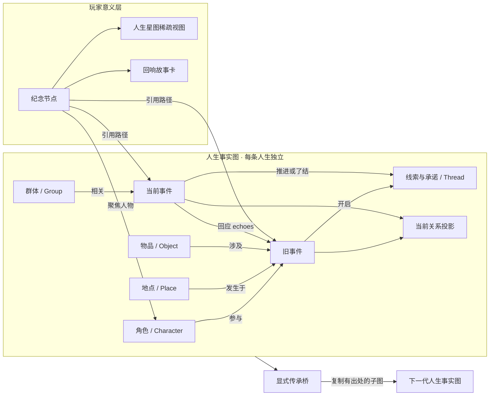

# Endless Worlds 世界记忆、人生星图与回响故事卡设计

> 状态：Phase 0–4 全部已实现（回合写入协议、事实图、回响召回与标记、收藏、三视图星图、回响故事卡、传承桥）。故事卡首版导出 HTML/Markdown/SVG——PNG 需引入渲染依赖，延后。  
> 日期：2026-08-19  
> 范围：世界记忆、叙事回响、纪念收藏、人生星图、故事卡分享、传承桥  
> 不包含：具体视觉稿、公开托管服务、任意历史分支

## 1. 摘要

Endless Worlds 已经能够保存每个回合的正文、玩家行动、事件、得失和完整当前状态，但这些内容主要以时间线和状态面板存在。玩家能够读到过去，却还不能稳定地感受到“世界记得我”，也无法把一次跨越多年才兑现的因果保存成属于自己的纪念。

本设计引入一套隐藏在叙事之下的事件中心 Graph：

1. Narrator 在提交回合时，以结构化声明写入实体、事件和关系变化。
2. 后端从事实图中召回少量旧事候选，Narrator 决定何时自然兑现。
3. 新事件若回应旧事件，必须显式声明 `echoes`，形成可验证的回响路径。
4. 玩家可把一个片段或整条回响路径收藏为独立“纪念节点”。
5. 默认界面仍然是故事；玩家主动打开“人生星图”时，才看到经过筛选的稀疏关系图。
6. 分享时从纪念节点引用的子图生成“回响故事卡”，先预览和删改，再导出。
7. 每条人生的事实图彼此隔离；世界明确允许时，可通过传承桥把选定遗产带入下一代。

产品目标不是把游戏变成知识图谱工具，而是创造这一瞬间：

> 原来世界真的记得我做过什么。

## 2. 已确认的产品决策

- Graph 藏在底层，默认不取代故事阅读界面。
- 人生星图由玩家按需打开，并提供“人生 / 人物 / 纪念”三种正式视图。
- 三种视图共用同一份 Graph 数据；时间星座是默认视图，关系轨道和纪念地图按入口智能聚焦。
- 收藏生成独立纪念节点，不修改世界事实。
- 采用“密图存储、疏图呈现”。
- 采用事件中心模型，并从事件投影当前关系。
- 只有结构化回合声明能写入事实图；不从正文静默抽取事实。
- 后端负责召回候选，Narrator 决定是否在剧情中兑现。
- 回响在当下以低打扰标记出现，可一键收藏整条路径。
- 首版分享物是“回响故事卡 + 小关系图”。
- 故事卡自动编排，但导出前允许预览、删改和匿名化。
- 每条人生独立建图，允许世界显式建立传承桥。

## 3. 目标与非目标

### 3.1 目标

- 让多年以前的选择、承诺、人物和物品能够稳定回到故事中。
- 让每次回响都能追溯到真实回合，而不是 Narrator 临时声称“以前发生过”。
- 让玩家保存“为什么这一刻重要”，而不只是收藏一段孤立文字。
- 让收藏自然成为人生星图和分享内容的入口。
- 保持幻想、现代、科幻、非人类世界都能使用的类型中立性。
- 不破坏现有单写入者、回合幂等、人生隔离和无网络权限边界。

### 3.2 非目标

- 不做通用社交网络、关注、点赞或排行榜。
- 不自动把玩家内容上传到公共服务器。
- 不从 prose 二次推断事实并写回世界。
- 不把所有图节点同时展示给玩家。
- 不在首版提供任意历史分支或从旧回合恢复状态。
- 不默认让同一世界的平行人生共享记忆。

## 4. 概念模型

事实层与玩家意义层分开：前者回答“发生过什么”，后者回答“什么对我重要”。



### 4.1 节点类型

事实图首版只需要五类通用实体和一种事件：

| 类型 | 用途 | 示例 |
|---|---|---|
| `character` | 能行动或被关系指向的个体 | 人、龙、舰载 AI、蜂群意识 |
| `place` | 事件发生或实体归属的位置 | 村庄、空间站、梦境层 |
| `group` | 组织、阵营、家族或集体 | 教会、公司、舰队、部落 |
| `object` | 会被获得、失去、传承或改变的事物 | 戒指、法术书、身份芯片 |
| `thread` | 跨回合持续的承诺、目标、秘密或冲突 | 赴约、复仇、调查失踪案 |
| `event` | 某回合发生的不可覆盖事实 | 相遇、选择、失去、发现、背叛 |

`keepsake` 属于玩家层，不属于事实层。`story-card` 是导出草稿，也不属于事实层。

### 4.2 边类型

核心边保持少而稳定：

- `participated_in`：实体参与事件。
- `occurred_at`：事件发生于地点。
- `involved`：事件涉及物品、群体或 thread。
- `opened` / `advanced` / `resolved`：事件对 thread 的作用。
- `echoes`：新事件明确回应旧事件。
- `caused_relation_change`：事件导致关系变化。
- `cites`：纪念节点引用事实节点或路径。
- `inherits_from`：下一代节点经传承桥引用上一代来源。

不提供 Narrator 可任意发明的自由边类型。世界自己的词汇放在 `label` 或 `tags`，核心关系仍由上述类型表达。

### 4.3 当前关系是投影，不覆盖历史

人物之间的信任、敌意、归属、债务等“当前状态”由历次关系变化累计得到。事实图保留每次变化及其来源事件，读取接口再投影出当前关系。

这样既能显示“她现在信任你”，也能解释“因为第 8、19、31 回合发生了这些事”。重算投影必须得到相同结果。

## 5. 回合写入协议

### 5.1 单写入者不变

`endless_advance_turn` 继续是唯一能改变人生的 MCP 工具。Graph 不增加第二个写工具，避免出现“正文已提交、记忆没提交”或两名 Narrator 并发改图。

现有参数新增可选 `memory`：

```json
{
  "memory": {
    "entities": [
      {
        "id": "elin",
        "kind": "character",
        "name": "艾琳",
        "aliases": ["桥边的女孩"]
      }
    ],
    "events": [
      {
        "key": "saved-elin",
        "title": "在石桥下救出艾琳",
        "summary": "洪水冲毁石桥时，你把艾琳拉上岸。",
        "importance": "notable",
        "participants": ["player", "elin"],
        "place": "old-stone-bridge",
        "threads": [{"id": "elin-debt", "effect": "opened"}],
        "echoes": [],
        "disclosure": "known"
      }
    ],
    "relations": [
      {
        "from": "elin",
        "type": "trust",
        "to": "player",
        "change": "increase",
        "reasonEvent": "saved-elin"
      }
    ]
  }
}
```

### 5.2 服务端负责盖章

Narrator 不得声明这些字段，全部由服务端写入：

- `runId`
- `turn`
- 规范事件 ID，例如 `event:12:saved-elin`
- 创建时间
- 来源工具与 schema 版本
- 玩家可见性最终裁决

事件 `key` 只需在当前回合内唯一。后续召回候选使用服务端规范 ID。

### 5.3 写入规则

- `memory` 可选，以兼容旧世界和不产生图事实的回合。
- 一旦提供，整个 `memory` 必须先通过结构和语义校验，再提交任何内容。
- 未知实体引用、重复 ID、非法回响目标或跨人生引用会拒绝本次工具调用。
- 拒绝返回精确字段路径，Narrator 可修正后重试。
- Narrator 可以删掉有问题的 `memory` 后提交正文，但系统应记录“本回合无结构化记忆”，不得从 prose 补写。
- 事件追加后不可改写；更正通过新的 `correction` 事件表达。
- 实体可以增加别名或摘要，但不得无证据改变类型。
- 不自动合并同名实体；合并必须是显式、可追溯操作。

### 5.4 认知与剧透边界

每个事件必须声明 `disclosure`：

- `known`：玩家亲历或已明确得知，可进入星图、收藏和分享。
- `rumoured`：玩家知道“有这种说法”，但内容不等于事实。
- `foreshadowed`：玩家只看到迹象；UI 不显示隐藏解释。
- `hidden`：仅用于世界连续性，不得出现在玩家 API、星图或故事卡中。

传闻应建模为“某人传播了某说法”这一已发生事件，而不是把说法内容当成已证实事实。

## 6. 存储与一致性

### 6.1 事实来源

Graph delta 与 prose、action、events、gains 一起进入同一个回合记录。事实图以回合记录为 canonical source，索引与当前关系投影都可重建。

建议新增：

- `runs/<run_id>/turns/<turn>.json`：原子写入的 canonical turn envelope。
- `runs/<run_id>/graph-index.json`：可删除重建的实体与邻接索引。
- `runs/<run_id>/relation-projection.json`：可删除重建的当前关系。
- `runs/<run_id>/keepsakes.jsonl`：玩家层纪念节点。
- `runs/<run_id>/story-cards/<id>.json`：尚未导出的编辑草稿。

### 6.2 提交顺序

长期正确方案是把完整回合 envelope 先写临时文件并原子 rename，再更新 current state、chronicle 兼容视图和图索引。若进程在中间退出，恢复逻辑以 canonical envelope 补齐派生数据。

首版若暂时沿用现有 `commit_state()` + `append_turn()`，Graph delta 必须至少与 chronicle 使用同一条 JSON 记录，不能单独维护第二份不可重建日志。

### 6.3 删除与导出

- 删除人生时必须连同事实图、纪念节点、卡片草稿和传承候选一并删除。
- 导出人生时包含 Graph schema 版本和 canonical IDs。
- 导入人生必须生成新 run ID，并重写人生作用域 ID，不能覆盖本地人生。

## 7. 回响召回

### 7.1 系统召回，Narrator 决定

`endless_read_runtime` 返回最多 6 个 `memoryCandidates`，而不是推送整张图。每个候选只包含：

- 规范 ID、回合、标题和短摘要。
- 相关实体与 thread。
- 玩家当时的行动。
- 候选原因，例如 `same-character`、`open-thread`、`dormant-important`。
- 最近一次被回响的回合。

Narrator 可在需要时按 ID 请求有限邻居，但不能一次读取整张图。

### 7.2 候选评分

候选分数由确定性规则计算：

1. 与最近事件共享角色、地点、物品或 thread。
2. 与玩家当前行动提及或当前场景焦点相关。
3. 尚未解决的承诺、目标、秘密或冲突。
4. 重要但长期未被提及。
5. 玩家创建过纪念，但要有重复曝光惩罚。
6. 低频加入一个“意外但可解释”的二跳候选。

必须施加冷却：刚被回响的事件不能连续数回合反复出现。收藏仅轻微提高召回权重，不能让玩家喜欢的一件事霸占整个人生。

### 7.3 回响成立条件

只有当前回合的新事件在结构化声明中引用旧事件 `echoes`，回响才成立。仅在 prose 中提到“想起当年”不会生成边，也不会出现产品提示。

这保证每个“往事回响”都能：

- 跳回源回合。
- 展示中间关联人物与 thread。
- 被整体收藏。
- 在故事卡中证明其时间跨度。

## 8. 玩家体验

### 8.1 回合中的低打扰提示

正文仍是主角。若本回合存在 `echoes`，在相关正文之后显示一条轻量标记：

> 往事回响 · 这回应了第 12 回合在石桥下发生的事

展开后显示：

- 源事件标题与一句摘要。
- 当时玩家采取的行动。
- 当前事件如何回应它。
- “回到那一页”。
- “收藏这段回响”。

不使用全屏庆祝、成就音效或连续弹窗。

### 8.2 创建纪念节点

玩家可以从三处创建纪念：

1. 回响标记：默认收藏整条回响路径。
2. 单个事件或人生星图节点。
3. 正文选中片段：保存引用文本、turn 和内容 hash，并关联所属事件。

纪念节点包含：

- 玩家可改的标题。
- 可选感想。
- 引用的事实节点和明确路径。
- 选中的原文片段。
- 创建时间。
- 是否包含结局剧透。

纪念节点不会改变 Narrator 看到的世界事实。它只影响玩家视图、轻量召回权重和分享入口。

### 8.3 人生星图

入口放在人生页的次级操作区，与“看看这一刻的自己”和历史回看同级，不放在每回合行动按钮旁。Graph 仍是底层结构；玩家进入人生星图后，可以在同一页面切换“人生 / 人物 / 纪念”三种观察镜头。

三种视图共用同一份稀疏子图，默认只加载：

- 重大事件。
- 已发生回响的事件。
- 玩家纪念。
- 当前未完成 thread。
- 与上述节点直接相关的少量实体。

#### 8.3.1 三种正式视图

| UI 名称 | 布局 | 主要问题 | 默认聚焦 |
|---|---|---|---|
| **人生** | 时间星座 | “我的人生如何走到这里？” | 当前人生阶段与最近重大事件 |
| **人物** | 关系轨道 | “我与这个人为什么变成现在这样？” | 玩家或入口指定的人物 |
| **纪念** | 纪念地图 | “哪些时刻对我最重要？” | 最近创建或入口指定的纪念 |

- **时间星座**：时间轴是骨架，人物与地点围绕关键事件分簇，用于阅读人生因果和跨年回响；它是从人生页直接进入时的默认视图。
- **关系轨道**：以玩家或指定人物为中心，人物、群体和关键事件按关系距离分层；关系边必须能展开到导致当前投影的来源事件。
- **纪念地图**：以纪念节点为主，明确引用的事件路径和相关实体向外展开；故事卡从这里进入，但不会自动扩张纪念的 allowlist。

这三种视图不是三张图、三个存储模型或三套互不相通的页面。它们是同一个 Graph payload 上的三个布局适配器，切换视图不触发事实复制、重新召回或数据迁移。

#### 8.3.2 智能入口与用户选择

系统根据入口选择初始镜头：

- 从人生页进入：打开“人生”，聚焦当前阶段。
- 从人物卡进入：打开“人物”，聚焦该人物。
- 从纪念、回响路径或故事卡进入：打开“纪念”，聚焦对应纪念。
- 若入口没有明确语义：恢复该人生最后使用的视图；首次使用时回到“人生”。

顶部提供持续可见的“人生 / 人物 / 纪念”切换器。智能入口只决定初始状态，不能锁定视图；玩家随时可以选择其他镜头。最后使用的视图按人生保存，不能污染同世界的其他人生。

#### 8.3.3 三视图共享交互

- 点击节点展开一跳邻居。
- 点击事件跳回原回合。
- 按人物、地点、thread 和人生阶段筛选。
- 隐藏节点只影响视图，不删除事实。
- 切换视图时保留当前选中节点、筛选条件、披露过滤和详情面板；新布局围绕同一节点重新定位。
- 若当前节点在目标视图默认集合之外，临时把它作为聚焦节点显示，而不是清空选择。
- 节点颜色、图标、披露状态和详情文案在三种视图中保持一致；只有空间布局和强调顺序变化。
- “只看我的纪念”是共享筛选器，不再代替纪念视图。

#### 8.3.4 移动端呈现

手机宽度下仍保留三视图选择，但不要求三种布局都缩成不可读的小画布：

- “人生”默认使用纵向时间星座，可展开事件分簇。
- “人物”和“纪念”提供“画布 / 列表”切换；列表使用相同节点和边，不是另一套简化事实。
- 切换视图后焦点节点自动滚入可见区域，详情面板使用底部抽屉。
- 桌面与手机共享最后视图偏好，但各自保存画布缩放和面板展开状态。

实现以已确认的三套 mockup 分别作为布局视觉规范，不采用通用 force-directed graph 的默认外观，也不要求玩家在首次进入时先做模式选择。

### 8.4 回响故事卡

从纪念节点点击“做成故事卡”，系统自动生成草稿：

- 标题与一句封面句。
- 2–5 个按时间排列的关键事件。
- 每个事件的一句摘要或玩家选中的原文。
- 相关人物、地点和物品。
- 一张只含本卡节点的小关系图。
- 可选结尾感想。

导出前玩家可以：

- 删除事件或实体。
- 调整事件顺序，但不能篡改原回合编号。
- 修改标题、封面句和自己的感想。
- 隐藏或替换人物名。
- 选择是否显示结局与剧透提示。
- 预览中文或英文界面包装；原故事文本不自动翻译。

故事卡严格使用纪念节点明确引用的 allowlist 子图，不自动沿边扩张。`hidden`、未选择的 `foreshadowed` 内容和其他人生数据永不进入草稿。

首版导出 PNG 与自包含 HTML/Markdown，不自动上传。公共链接属于后续独立能力，需要明确的网络权限和用户确认。

## 9. 传承桥

每条人生默认完全隔离。只有世界模板声明允许连续性，且玩家在人生终章确认，才建立传承桥。

桥接流程：

1. 终章列出世界允许继承的候选：人物关系、物品、家族、秘密、债务、声望、地点变化。
2. 玩家确认继承人或下一代起点。
3. 系统复制选定事实子图到新人生，生成新的作用域 ID。
4. 每个复制节点保存 `inherits_from` 来源、原 run ID、原节点 ID 和原回合。
5. 下一代 Narrator 只看到新人生图及允许的来源摘要，不能读取上一世全部私有图。

传承不是共享可变图。上一代后续不会被下一代反向修改，两边都保留稳定历史。

## 10. API 与代码落点

建议新增只读和玩家层写接口：

- `GET /runs/{id}/memory/star`：返回与布局无关的稀疏星图；三种视图复用同一 payload。
- `GET /runs/{id}/memory/nodes/{node_id}`：节点与有限邻居。
- `PATCH /runs/{id}/preferences/memory-view`：保存该人生最后使用的视图，不改变事实图。
- `POST /runs/{id}/keepsakes`：创建纪念。
- `PATCH /runs/{id}/keepsakes/{id}`：标题、感想和引用范围。
- `DELETE /runs/{id}/keepsakes/{id}`：删除纪念，不动事实。
- `POST /runs/{id}/story-cards/preview`：生成可编辑草稿。
- `PATCH /runs/{id}/story-cards/{id}`：编辑 allowlist 与包装。
- `GET /runs/{id}/story-cards/{id}/export`：导出文件。

主要代码落点：

- `backend/mcp_server.py`：`memory` schema、语义校验、回合写入。
- `backend/store.py`：canonical turn envelope、图索引、关系投影、纪念存储。
- 新建 `backend/memory_graph.py`：纯数据结构、重建、召回和过滤。
- `backend/routes.py`：人生星图、纪念和故事卡 API。
- `backend/view.py`：当前回合的回响摘要。
- `web/src/api.ts`：Graph、Keepsake、StoryCard 类型。
- `web/src/play.tsx`：回响标记与收藏入口。
- 新建 `web/src/memory.tsx`：人生星图容器、三视图切换、共享筛选与节点详情。
- 新建 `web/src/memory-state.ts`：跨布局保留焦点、筛选、披露状态和每人生视图偏好。
- 新建 `web/src/memory-layouts/timeline.tsx`：时间星座布局。
- 新建 `web/src/memory-layouts/relations.tsx`：关系轨道布局。
- 新建 `web/src/memory-layouts/keepsakes.tsx`：纪念地图布局。
- 新建 `web/src/story-card.tsx`：故事卡预览与编辑。
- `web/src/strings/zh.json`、`web/src/strings/en.json`：全部玩家文案。

## 11. MVP 分期

### Phase 0：数据正确性

- 定义 Graph schema 与版本。
- 在 `endless_advance_turn` 中接受可选 `memory`。
- 同回合原子记录 Graph delta。
- 可从 canonical turns 重建实体索引和关系投影。
- 删除人生无残留。

完成标准：禁用所有索引后仍可从回合记录重建相同图。

### Phase 1：世界记得我

- `endless_read_runtime` 返回召回候选。
- Narrator 可声明 `echoes`。
- 玩家页显示可追溯的“往事回响”。
- 冷却、剧透过滤和人生隔离生效。

完成标准：测试人生中，第 2 个事件引用第 1 个事件时，UI 能跳回正确回合；没有结构化引用时绝不伪造提示。

### Phase 2：收藏与三视图闭环

- 收藏单事件、回响路径和正文片段。
- 纪念节点可重命名、写感想和删除。
- 人生星图提供“人生 / 人物 / 纪念”三种正式视图，共用同一稀疏子图和详情面板。
- 支持按入口智能聚焦、手动切换和每人生视图偏好。
- 手机端完成纵向时间星座，以及人物/纪念的画布与列表模式。

可按“共享状态与时间星座 → 关系轨道 → 纪念地图”的顺序开发，但 Phase 2 只有三种视图全部可用才算完成。

完成标准：收藏与删除纪念不会改变事实图或 Narrator 状态；切换任意视图后，当前焦点、筛选和披露边界保持一致。

### Phase 3：分享闭环

- 自动生成故事卡草稿。
- 预览、删改、匿名化和剧透控制。
- 导出 PNG 与自包含文档。

完成标准：导出内容严格等于预览 allowlist；隐藏节点与未选邻居无法出现在文件中。

### Phase 4：传承桥

- 世界模板声明传承能力与可继承类型。
- 终章选择并复制子图。
- 下一代显示来源，但不获得上一代整图。

完成标准：普通平行人生仍完全隔离；只有显式桥接的数据可跨 run 读取。

## 12. 测试与安全门

### 12.1 数据测试

- 同一 `(runId, turn)` 重试不重复创建节点或边。
- malformed memory 不产生部分写入。
- 同名不同 ID 不自动合并。
- 未知 ID 和跨人生 ID 被拒绝。
- 事件不可覆盖，只能追加更正。
- 删除图索引后重建结果字节稳定。
- 关系投影重建结果稳定。

### 12.2 回响测试

- 候选只来自当前人生。
- `hidden` 永不出现在玩家 API。
- 回响必须引用真实旧事件。
- 冷却阻止同一旧事连续刷屏。
- 收藏只轻微加权，不保证被 Narrator 使用。

### 12.3 分享测试

- 故事卡只包含 allowlist 节点。
- 删除节点后相关边同步消失。
- 匿名化覆盖标题、正文摘录、图标签和 alt text。
- 剧透关闭时结局节点与隐含结局文案都被过滤。
- 导出文件无网络请求、无运行时 API token、无其他人生 ID。

### 12.4 三视图一致性测试

- 三种视图接收同一 Graph payload 时，可见节点和 disclosure 过滤结果一致。
- 切换布局不发起事实写入，不创建重复节点，也不改变纪念 allowlist。
- 当前选中节点在三种视图间保持；目标布局默认不含该节点时仍能临时聚焦。
- 从人生页、人物卡、纪念和故事卡进入时，分别打开正确视图与焦点。
- 最后视图偏好按人生隔离；切换人生不会继承上一条人生的选择。
- 手机列表与画布显示相同节点、边和来源事件。
- 空图、单节点、无纪念和焦点节点被删除时都有稳定降级行为。

### 12.5 新玩家可用性门

实现后必须由不知设计背景的测试者验证：

- 能否理解“往事回响”而不懂 Graph。
- 能否找到收藏入口。
- 是否知道人生星图不会改变故事。
- 能否在导出前发现和移除不想分享的名字。
- 空图、只有一个节点和百回合密图是否仍可理解。

## 13. 成功指标

优先观察行为，而不是图规模：

- 出现回响后展开来源的比例。
- 回响路径被收藏的比例。
- 收藏后打开人生星图的比例。
- “人生 / 人物 / 纪念”各视图的使用率、切换率与任务完成率。
- 从人物卡或纪念入口进入后，继续探索关联节点的比例。
- 故事卡预览到实际导出的完成率。
- 玩家返回旧人生并继续推进的比例。
- 回响重复、错误引用和剧透泄漏的报告数。

节点数、边数和 Narrator 每回合写入量只是运行健康指标，不是产品成功指标。

## 14. 风险与缓解

| 风险 | 缓解 |
|---|---|
| Narrator 每回合声明过多事实 | schema 限额、importance 分级、只记录明确变化 |
| ID 漂移导致同一人物分裂 | 召回时提供规范 ID；同名不自动合并；提供显式 alias/merge 流程 |
| 回响显得机械 | 系统只给候选，Narrator 决定是否使用；加入冷却 |
| 收藏导致故事反复迎合玩家 | 收藏只轻微加权，不成为硬指令 |
| 图 UI 变成工程工具 | 默认隐藏、疏图呈现；三种视图分别围绕人生、人物和纪念回答自然问题 |
| 三视图增加认知与维护成本 | 智能入口而非首次选择；共享数据、状态、详情组件和视觉语义，只替换布局适配器 |
| 分享泄漏秘密或其他人生 | 服务端 disclosure 过滤 + allowlist 子图 + 导出预览 |
| Graph 写坏核心回合 | 仍只有一个写入者；先完整校验；图索引可重建 |
| 跨世代污染平行人生 | 每人生独立；传承复制而非共享；来源可追溯 |

## 15. 已确定的视觉方案与待细化项

三套 mockup 均作为正式产品视图保留，不再三选一：

1. “人生”使用时间星座，并作为人生页进入时的默认镜头。
2. “人物”使用关系轨道，并从人物卡入口自动聚焦对应人物。
3. “纪念”使用纪念地图，并承接纪念整理与故事卡制作。
4. 三种视图在同一页面切换，复用同一 Graph、筛选器、选中状态和详情面板。

进入实现前仍需在视觉规范中细化：

1. 三个布局在空图、单节点、十回合和百回合密度下的间距、聚类与缩放参数。
2. 视图切换器在桌面和手机的样式，以及保持焦点时的转场动效。
3. “往事回响”在正文中的展开密度。
4. 回响故事卡的版式、主题变量和小关系图位置。
5. 人物与纪念视图的手机“画布 / 列表”切换，以及底部详情抽屉高度。
6. 中英文长标签、匿名化名称和无障碍放大字号下的截断规则。

已确认的三套 mockup 分别成为对应布局的视觉规范；后续视觉验证比较的是实现与 mockup 的一致性，而不是再次选择保留哪一套。
