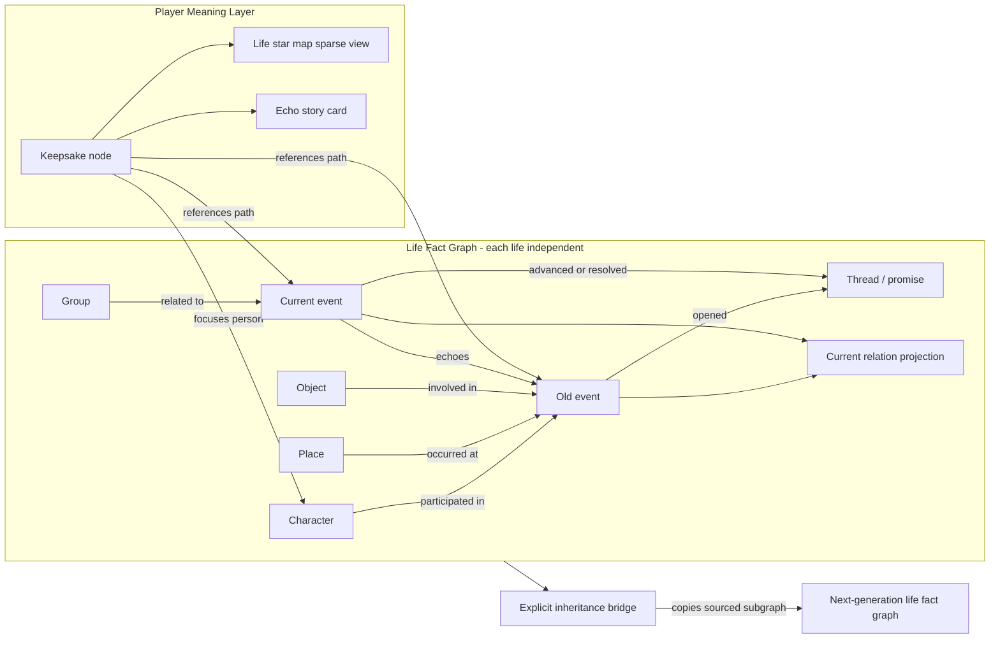

# Endless Worlds: World Memory, Life Star Map, and Echo Story Card Design

> Status: Phase 0-4 all implemented (turn write protocol, fact graph, echo recall and marking, keepsakes, three-view star map, echo story cards, inheritance bridge). Story card first version exports HTML/Markdown/SVG -- PNG requires pulling in a rendering dependency, deferred.  
> Date: 2026-08-19  
> Scope: world memory, narrative echoes, commemorative keepsakes, life star map, story card sharing, inheritance bridge  
> Out of scope: specific visual mockups, public hosting service, arbitrary history branching

## 1. Summary

Endless Worlds can already save each turn's prose, player actions, events, gains/losses, and complete current state, but this content exists primarily as a timeline and a status panel. Players can read the past, yet they still cannot reliably feel that "the world remembers me," nor can they save a piece of cause-and-effect that took years to pay off as a keepsake of their own.

This design introduces an event-centric Graph hidden beneath the narrative:

1. When the Narrator commits a turn, it writes entities, events, and relation changes via structured declarations.
2. The backend recalls a small number of old-event candidates from the fact graph, and the Narrator decides when to pay them off naturally.
3. If a new event responds to an old event, it must explicitly declare `echoes`, forming a verifiable echo path.
4. The player can save a fragment or an entire echo path as an independent "keepsake node."
5. The default interface is still the story; only when the player actively opens the "life star map" do they see a filtered, sparse relation graph.
6. When sharing, an "echo story card" is generated from the subgraph referenced by keepsake nodes -- previewed and edited first, then exported.
7. Each life's fact graph is isolated from the others; when a world explicitly allows it, selected legacy can be carried into the next generation through an inheritance bridge.

The product goal is not to turn the game into a knowledge-graph tool, but to create this moment:

> So the world really did remember what I did.

## 2. Confirmed Product Decisions

- The Graph stays at the underlying layer and does not replace the story-reading interface by default.
- The life star map is opened on demand by the player and offers three formal views: "life / people / keepsakes."
- The three views share the same Graph data; the time constellation is the default view, and the relation orbits and keepsake map intelligently focus based on the entry point.
- Keepsakes generate independent keepsake nodes and do not modify world facts.
- Adopt "store the dense graph, present the sparse graph."
- Adopt an event-centric model and project current relations from events.
- Only structured turn declarations can write to the fact graph; facts are not silently extracted from prose.
- The backend is responsible for recalling candidates; the Narrator decides whether to pay them off in the plot.
- Echoes appear as low-intrusion markers in the present, with one-tap saving of the entire path.
- The first shareable artifact is an "echo story card + small relation graph."
- Story cards are automatically composed, but preview, editing, and anonymization are allowed before export.
- Each life builds its graph independently, and worlds are allowed to explicitly establish an inheritance bridge.

## 3. Goals and Non-Goals

### 3.1 Goals

- Let choices, promises, people, and objects from many years ago reliably return to the story.
- Let every echo be traceable to a real turn, rather than the Narrator temporarily claiming "this happened before."
- Let players save "why this moment matters," not just save an isolated piece of text.
- Let keepsakes naturally become the entry point to the life star map and shared content.
- Preserve the genre neutrality that lets fantasy, modern, sci-fi, and non-human worlds all use it.
- Do not break the existing single-writer, turn-idempotency, life-isolation, and no-network permission boundaries.

### 3.2 Non-Goals

- Do not build a general social network, follows, likes, or leaderboards.
- Do not automatically upload player content to a public server.
- Do not re-infer facts from prose and write them back into the world.
- Do not show all graph nodes to the player at once.
- Do not offer arbitrary history branching or restoring state from old turns in the first version.
- Do not, by default, let parallel lives in the same world share memory.

## 4. Conceptual Model

The fact layer and the player-meaning layer are separate: the former answers "what happened," the latter answers "what matters to me."



### 4.1 Node Types

The first version of the fact graph needs only five general entity types and one event type:

| Type | Purpose | Examples |
|---|---|---|
| `character` | An individual that can act or be the target of a relation | person, dragon, shipboard AI, hive mind |
| `place` | The location where an event happens or an entity belongs | village, space station, dream layer |
| `group` | Organization, faction, family, or collective | church, company, fleet, tribe |
| `object` | A thing that gets acquired, lost, inherited, or changed | ring, spellbook, identity chip |
| `thread` | A promise, goal, secret, or conflict that persists across turns | keeping an appointment, revenge, investigating a disappearance |
| `event` | An un-overwritable fact that happened on a given turn | encounter, choice, loss, discovery, betrayal |

`keepsake` belongs to the player layer, not the fact layer. `story-card` is an export draft and also does not belong to the fact layer.

### 4.2 Edge Types

Core edges stay few and stable:

- `participated_in`: an entity participated in an event.
- `occurred_at`: an event occurred at a place.
- `involved`: an event involved an object, group, or thread.
- `opened` / `advanced` / `resolved`: an event's effect on a thread.
- `echoes`: a new event explicitly responds to an old event.
- `caused_relation_change`: an event caused a relation change.
- `cites`: a keepsake node references a fact node or path.
- `inherits_from`: a next-generation node references a previous-generation source through the inheritance bridge.

There is no free-form edge type the Narrator can invent at will. A world's own vocabulary goes in `label` or `tags`; core relations are still expressed by the types above.

### 4.3 Current Relations Are a Projection, Not an Overwrite of History

"Current state" between characters -- trust, hostility, belonging, debt, and so on -- is accumulated from successive relation changes. The fact graph retains each change and its source event, and the read interface then projects out the current relation.

This lets it both show "she trusts you now" and explain "because of what happened on turns 8, 19, and 31." Recomputing the projection must yield the same result.

## 5. Turn Write Protocol

### 5.1 Single Writer Invariant

`endless_advance_turn` remains the only MCP tool that can change a life. The Graph does not add a second write tool, avoiding "the prose is committed but the memory is not" or two Narrators concurrently editing the graph.

The existing parameters gain an optional `memory`:

```json
{
  "memory": {
    "entities": [
      {
        "id": "elin",
        "kind": "character",
        "name": "Elin",
        "aliases": ["the girl by the bridge"]
      }
    ],
    "events": [
      {
        "key": "saved-elin",
        "title": "Rescued Elin under the stone bridge",
        "summary": "When the flood destroyed the stone bridge, you pulled Elin ashore.",
        "importance": "notable",
        "participants": ["player", "elin"],
        "place": "old-stone-bridge",
        "threads": [{"id": "elin-debt", "effect": "opened"}],
        "echoes": [],
        "disclosure": "known"
      }
    ],
    "relations": [
      {
        "from": "elin",
        "type": "trust",
        "to": "player",
        "change": "increase",
        "reasonEvent": "saved-elin"
      }
    ]
  }
}
```

### 5.2 The Server Stamps the Record

The Narrator must not declare these fields; they are all written by the server:

- `runId`
- `turn`
- the canonical event ID, e.g. `event-12-saved-elin`
- creation time
- source tool and schema version
- the final ruling on player visibility

The event `key` need only be unique within the current turn. Subsequent recall candidates use the canonical server ID.

### 5.3 Write Rules

- `memory` is optional, for compatibility with old worlds and turns that produce no graph facts.
- Once provided, `memory` is SALVAGED, not rejected whole: `sanitize_memory` records every part that passes and drops only the pieces that do not, so one bad reference never costs the real memory around it.
- A structurally broken event (bad/duplicate/replayed key, missing title or summary, unknown disclosure) is dropped whole; an otherwise-good event keeps its title/summary and loses only its unresolved references (unknown participant, non-place `place`, dangling echo/corrects); a relation is a single edge dropped on any bad field. A thread is its own namespace — effect `opened` declares it, and only `advanced`/`resolved` on a never-opened thread is dropped.
- Every drop returns the exact field path and a narrator-facing detail, surfaced as a non-blocking warning so the Narrator can re-declare it later. Nothing is auto-created, nothing is back-filled from prose, and cross-life ids simply do not resolve.
- The Narrator may drop the problematic `memory` and commit the prose, but the system should record "no structured memory this turn" and must not back-fill from prose.
- Once appended, an event cannot be rewritten; corrections are expressed through a new `correction` event.
- An entity may gain aliases or a summary, but its type must not change without evidence.
- Same-named entities are not auto-merged; a merge must be an explicit, traceable operation.

### 5.4 Cognition and Spoiler Boundary

Every event must declare `disclosure`:

- `known`: the player experienced it or was explicitly told; it can enter the star map, keepsakes, and sharing.
- `rumoured`: the player knows "there is such a claim," but the content does not equal fact.
- `foreshadowed`: the player only sees signs; the UI does not reveal the hidden explanation.
- `hidden`: used only for world continuity; it must not appear in the player API, star map, or story cards.

A rumor should be modeled as the event "someone spread a certain claim," rather than treating the claim's content as a confirmed fact.

## 6. Storage and Consistency

### 6.1 Source of Facts

The Graph delta enters the same turn record together with prose, action, events, and gains. The fact graph uses the turn record as the canonical source; both the index and the current relation projection can be rebuilt.

Proposed additions:

- `runs/<run_id>/turns/<turn>.json`: the canonical turn envelope, written atomically.
- `runs/<run_id>/graph-index.json`: a deletable, rebuildable entity and adjacency index.
- `runs/<run_id>/relation-projection.json`: deletable, rebuildable current relations.
- `runs/<run_id>/keepsakes.jsonl`: player-layer keepsake nodes.
- `runs/<run_id>/story-cards/<id>.json`: edit drafts not yet exported.

### 6.2 Commit Order

The long-term correct approach is to write the complete turn envelope to a temp file first and atomically rename it, then update the current state, the chronicle-compatible view, and the graph index. If the process exits midway, the recovery logic fills in the derived data from the canonical envelope.

If the first version temporarily continues to use the existing `commit_state()` + `append_turn()`, the Graph delta must at least share the same JSON record as the chronicle, and cannot maintain a separate second un-rebuildable log.

### 6.3 Deletion and Export

- Deleting a life must delete the fact graph, keepsake nodes, card drafts, and inheritance candidates along with it.
- Exporting a life includes the Graph schema version and the canonical IDs.
- Importing a life must generate a new run ID and rewrite life-scoped IDs; it cannot overwrite a local life.

## 7. Echo Recall

### 7.1 The System Recalls, the Narrator Decides

`endless_read_runtime` returns at most 6 `memoryCandidates`, rather than pushing the entire graph. Each candidate contains only:

- canonical ID, turn, title, and short summary.
- related entities and threads.
- the player's action at the time.
- the candidate reason, e.g. `same-character`, `open-thread`, `dormant-important`.
- the turn on which it was most recently echoed.

The Narrator may request limited neighbors by ID when needed, but cannot read the whole graph at once.

### 7.2 Candidate Scoring

The candidate score is computed by deterministic rules:

1. Shares a character, place, object, or thread with recent events.
2. Related to what the player's current action mentions or the current scene focus.
3. An unresolved promise, goal, secret, or conflict.
4. Important but long unmentioned.
5. The player created a keepsake, but with a repeat-exposure penalty.
6. Low-frequency inclusion of one "surprising but explainable" two-hop candidate.

A cooldown must be applied: a just-echoed event cannot reappear repeatedly for several turns in a row. A keepsake only slightly raises recall weight; it cannot let one thing the player likes dominate the entire life.

### 7.3 Conditions for an Echo to Hold

An echo holds only when a new event in the current turn references an old event via `echoes` in a structured declaration. Merely mentioning "remembering the old days" in prose generates no edge and produces no product prompt.

This guarantees that every "echo of the past" can:

- jump back to the source turn.
- show the intermediate related people and threads.
- be saved as a whole.
- prove its time span in the story card.

## 8. Player Experience

### 8.1 Low-Intrusion Prompt During a Turn

The prose remains the protagonist. If this turn contains `echoes`, a lightweight marker is shown after the relevant prose:

> Echo of the past - this responds to what happened under the stone bridge on turn 12

When expanded, it shows:

- the source event's title and a one-sentence summary.
- the action the player took at the time.
- how the current event responds to it.
- "Return to that page."
- "Save this echo."

No full-screen celebration, achievement sound effects, or successive popups are used.

### 8.2 Creating a Keepsake Node

The player can create a keepsake from three places:

1. The echo marker: by default saves the entire echo path.
2. A single event or life star map node.
3. A selected fragment of prose: saves the referenced text, turn, and content hash, and associates it with the owning event.

A keepsake node contains:

- a title the player can change.
- an optional reflection.
- the referenced fact nodes and an explicit path.
- the selected original fragment.
- creation time.
- whether it contains an ending spoiler.

A keepsake node does not change the world facts the Narrator sees. It only affects the player views, the light recall weight, and the sharing entry point.

### 8.3 Life Star Map

The entry point sits in the secondary action area of the life page, at the same level as "see who you are in this moment" and history review, not next to the per-turn action buttons. The Graph is still the underlying structure; once the player enters the life star map, they can switch between three observation lenses -- "life / people / keepsakes" -- on the same page.

The three views share the same sparse subgraph and by default load only:

- major events.
- events that have already echoed.
- player keepsakes.
- currently unfinished threads.
- a small number of entities directly related to the above nodes.

#### 8.3.1 The Three Formal Views

| UI name | Layout | Primary question | Default focus |
|---|---|---|---|
| **Life** | Time constellation | "How did my life get here?" | the current life phase and recent major events |
| **People** | Relation orbits | "Why did this person and I become what we are now?" | the player or the person specified by the entry point |
| **Keepsakes** | Keepsake map | "Which moments matter most to me?" | the most recently created keepsake or the one specified by the entry point |

- **Time constellation**: the timeline is the skeleton, with people and places clustered around key events; used to read life cause-and-effect and cross-year echoes; it is the default view when entering directly from the life page.
- **Relation orbits**: centered on the player or a specified person, with people, groups, and key events layered by relational distance; relation edges must be expandable to the source events that produced the current projection.
- **Keepsake map**: centered on keepsake nodes, with explicitly referenced event paths and related entities expanding outward; story cards are entered from here, but this does not automatically expand a keepsake's allowlist.

These three views are not three graphs, three storage models, or three mutually disconnected pages. They are three layout adapters over the same Graph payload; switching views triggers no fact duplication, re-recall, or data migration.

#### 8.3.2 Intelligent Entry Points and User Choice

The system chooses the initial lens based on the entry point:

- Entering from the life page: opens "Life," focused on the current phase.
- Entering from a person card: opens "People," focused on that person.
- Entering from a keepsake, echo path, or story card: opens "Keepsakes," focused on the corresponding keepsake.
- If the entry point has no clear semantics: restores the last view used in this life; on first use, falls back to "Life."

A persistently visible "life / people / keepsakes" switcher is provided at the top. The intelligent entry point only decides the initial state and cannot lock the view; the player can choose another lens at any time. The last-used view is saved per life and cannot pollute other lives in the same world.

#### 8.3.3 Shared Interactions Across the Three Views

- Click a node to expand its one-hop neighbors.
- Click an event to jump back to the original turn.
- Filter by person, place, thread, and life phase.
- Hiding a node only affects the view, it does not delete the fact.
- When switching views, the current selected node, filters, disclosure filtering, and the detail panel are preserved; the new layout re-positions around the same node.
- If the current node is outside the target view's default set, temporarily show it as a focus node rather than clearing the selection.
- Node colors, icons, disclosure state, and detail copy stay consistent across the three views; only spatial layout and emphasis order change.
- "Show only my keepsakes" is a shared filter and no longer substitutes for the keepsakes view.

#### 8.3.4 Mobile Presentation

At phone widths the three-view choice is still preserved, but the three layouts are not all required to shrink into an unreadable tiny canvas:

- "Life" uses a vertical time constellation by default, with expandable event clusters.
- "People" and "Keepsakes" offer a "canvas / list" toggle; the list uses the same nodes and edges, not a separate simplified set of facts.
- After switching views the focus node automatically scrolls into the visible area, and the detail panel uses a bottom drawer.
- Desktop and phone share the last-view preference, but each saves its own canvas zoom and panel expansion state.

The implementation uses the three confirmed mockups as the layout visual specs respectively, not the default look of a generic force-directed graph, and does not require the player to choose a mode first on entry.

### 8.4 Echo Story Card

From a keepsake node, clicking "make into a story card" auto-generates a draft:

- a title and a one-sentence cover line.
- 2-5 key events arranged in time order.
- a one-sentence summary of each event or the original text the player selected.
- related people, places, and objects.
- a small relation graph containing only this card's nodes.
- an optional closing reflection.

Before export, the player can:

- delete events or entities.
- reorder events, but not tamper with the original turn numbers.
- edit the title, cover line, and their own reflection.
- hide or replace people's names.
- choose whether to show the ending and spoiler prompts.
- preview the Chinese or English interface wrapping; the original story text is not auto-translated.

The story card strictly uses the allowlist subgraph explicitly referenced by the keepsake node and does not auto-expand along edges. `hidden`, unselected `foreshadowed` content, and other lives' data never enter the draft.

The first version exports PNG and self-contained HTML/Markdown, with no auto-upload. A public link is a separate later capability that requires explicit network permission and user confirmation.

## 9. Inheritance Bridge

Each life is fully isolated by default. An inheritance bridge is established only when the world template declares that continuity is allowed and the player confirms at the life's final chapter.

The bridging flow:

1. The final chapter lists the candidates the world allows to be inherited: character relations, objects, family, secrets, debts, reputation, place changes.
2. The player confirms the heir or the next generation's starting point.
3. The system copies the selected fact subgraph into the new life, generating new scoped IDs.
4. Each copied node saves the `inherits_from` source, the original run ID, the original node ID, and the original turn.
5. The next-generation Narrator sees only the new life's graph and the allowed source summaries; it cannot read the entire private graph of the previous life.

Inheritance is not a shared mutable graph. The previous generation is not retroactively modified by the next, and both sides keep a stable history.

## 10. API and Code Landing Points

Proposed new read-only and player-layer write interfaces:

- `GET /runs/{id}/memory/star`: returns a layout-independent sparse star map; the three views reuse the same payload.
- `GET /runs/{id}/memory/nodes/{node_id}`: a node and its limited neighbors.
- `PATCH /runs/{id}/preferences/memory-view`: saves the last view used in this life without changing the fact graph.
- `POST /runs/{id}/keepsakes`: creates a keepsake.
- `PATCH /runs/{id}/keepsakes/{id}`: title, reflection, and reference scope.
- `DELETE /runs/{id}/keepsakes/{id}`: deletes a keepsake without touching facts.
- `POST /runs/{id}/story-cards/preview`: generates an editable draft.
- `PATCH /runs/{id}/story-cards/{id}`: edits the allowlist and wrapping.
- `GET /runs/{id}/story-cards/{id}/export`: exports the file.

Main code landing points:

- `backend/mcp_server.py`: the `memory` schema, semantic validation, turn writes.
- `backend/store.py`: canonical turn envelope, graph index, relation projection, keepsake storage.
- new `backend/memory_graph.py`: pure data structures, rebuild, recall, and filtering.
- `backend/routes.py`: the life star map, keepsake, and story card APIs.
- `backend/view.py`: the current turn's echo summary.
- `web/src/api.ts`: Graph, Keepsake, StoryCard types.
- `web/src/play.tsx`: echo markers and the save entry point.
- new `web/src/memory.tsx`: the life star map container, three-view switching, shared filters, and node details.
- new `web/src/memory-state.ts`: preserving focus, filters, disclosure state, and per-life view preferences across layouts.
- new `web/src/memory-layouts/timeline.tsx`: the time constellation layout.
- new `web/src/memory-layouts/relations.tsx`: the relation orbits layout.
- new `web/src/memory-layouts/keepsakes.tsx`: the keepsake map layout.
- new `web/src/story-card.tsx`: story card preview and editing.
- `web/src/strings/zh.json`, `web/src/strings/en.json`: all player-facing copy.

## 11. MVP Phasing

### Phase 0: Data Correctness

- Define the Graph schema and version.
- Accept optional `memory` in `endless_advance_turn`.
- Atomically record the Graph delta in the same turn.
- Be able to rebuild the entity index and relation projection from canonical turns.
- Deleting a life leaves no residue.

Completion criterion: after disabling all indexes, the same graph can still be rebuilt from the turn records.

### Phase 1: The World Remembers Me

- `endless_read_runtime` returns recall candidates.
- The Narrator can declare `echoes`.
- The player page shows a traceable "echo of the past."
- Cooldown, spoiler filtering, and life isolation take effect.

Completion criterion: in a test life, when the second event references the first, the UI can jump back to the correct turn; when there is no structured reference, it never fabricates a prompt.

### Phase 2: The Keepsake and Three-View Loop

- Save single events, echo paths, and prose fragments.
- Keepsake nodes can be renamed, given reflections, and deleted.
- The life star map offers three formal views -- "life / people / keepsakes" -- sharing the same sparse subgraph and detail panel.
- Support intelligent focus by entry point, manual switching, and per-life view preferences.
- Complete the vertical time constellation on mobile, plus the canvas and list modes for people/keepsakes.

Development can proceed in the order "shared state and time constellation -> relation orbits -> keepsake map," but Phase 2 is only complete when all three views are available.

Completion criterion: saving and deleting a keepsake does not change the fact graph or Narrator state; after switching to any view, the current focus, filters, and disclosure boundary stay consistent.

### Phase 3: The Sharing Loop

- Auto-generate story card drafts.
- Preview, edit, anonymize, and spoiler control.
- Export PNG and self-contained documents.

Completion criterion: the exported content strictly equals the previewed allowlist; hidden nodes and unselected neighbors cannot appear in the file.

### Phase 4: Inheritance Bridge

- The world template declares the inheritance capability and inheritable types.
- The final chapter selects and copies the subgraph.
- The next generation shows the source but does not obtain the previous generation's entire graph.

Completion criterion: ordinary parallel lives remain fully isolated; only explicitly bridged data can be read across runs.

## 12. Tests and Safety Gates

### 12.1 Data Tests

- Retrying the same `(runId, turn)` does not create duplicate nodes or edges.
- Malformed memory produces no partial writes.
- Same name, different ID does not auto-merge.
- Unknown IDs and cross-life IDs are rejected.
- Events are not overwritable, only appendable via corrections.
- After deleting the graph index, the rebuild result is byte-stable.
- The relation projection rebuild result is stable.

### 12.2 Echo Tests

- Candidates come only from the current life.
- `hidden` never appears in the player API.
- An echo must reference a real old event.
- Cooldown prevents the same old event from spamming the screen in a row.
- A keepsake only slightly weights recall and does not guarantee the Narrator uses it.

### 12.3 Sharing Tests

- A story card contains only allowlist nodes.
- After deleting a node, the related edges disappear in sync.
- Anonymization covers the title, prose excerpts, graph labels, and alt text.
- When spoilers are off, both the ending node and any implied-ending copy are filtered.
- Exported files have no network requests, no runtime API token, and no other lives' IDs.

### 12.4 Three-View Consistency Tests

- When the three views receive the same Graph payload, the visible nodes and disclosure filtering results are consistent.
- Switching layouts issues no fact writes, creates no duplicate nodes, and does not change a keepsake's allowlist.
- The current selected node is preserved across the three views; when the target layout's default set does not contain that node, it can still be temporarily focused.
- Entering from the life page, a person card, a keepsake, or a story card opens the correct view and focus respectively.
- The last-view preference is isolated per life; switching lives does not inherit the previous life's choice.
- The mobile list and canvas show the same nodes, edges, and source events.
- Empty graph, single node, no keepsakes, and a deleted focus node all have stable degradation behavior.

### 12.5 New-Player Usability Gate

After implementation, it must be verified by a tester who does not know the design background:

- Can they understand "echo of the past" without understanding the Graph.
- Can they find the save entry point.
- Do they know the life star map does not change the story.
- Can they discover and remove names they do not want to share before export.
- Are the empty graph, a single node, and a hundred-turn dense graph still understandable.

## 13. Success Metrics

Prioritize observing behavior, not graph size:

- The proportion of source expansions after an echo appears.
- The proportion of echo paths that get saved.
- The proportion of players who open the life star map after saving.
- The usage rate, switch rate, and task-completion rate of each "life / people / keepsakes" view.
- The proportion of players who keep exploring related nodes after entering from a person card or keepsake.
- The completion rate from story card preview to actual export.
- The proportion of players who return to an old life and keep advancing it.
- The number of reports of echo repetition, wrong references, and spoiler leaks.

Node count, edge count, and the Narrator's per-turn write volume are only operational-health indicators, not product success metrics.

## 14. Risks and Mitigations

| Risk | Mitigation |
|---|---|
| The Narrator declares too many facts per turn | schema quotas, importance tiers, record only explicit changes |
| ID drift splits the same person | provide canonical IDs at recall time; no auto-merge for same names; provide an explicit alias/merge flow |
| Echoes feel mechanical | the system only offers candidates, the Narrator decides whether to use them; add a cooldown |
| Keepsakes make the story repeatedly pander to the player | keepsakes only slightly weight recall and are not a hard directive |
| The graph UI becomes an engineering tool | hidden by default, sparse presentation; the three views each answer a natural question around life, people, and keepsakes |
| The three views add cognitive and maintenance cost | intelligent entry point rather than a first-use choice; share data, state, detail components, and visual semantics, replacing only the layout adapter |
| Sharing leaks secrets or other lives | server-side disclosure filtering + allowlist subgraph + export preview |
| The Graph corrupts a core turn | still only one writer; validate fully first; the graph index is rebuildable |
| Cross-generation contamination of parallel lives | each life independent; inheritance copies rather than shares; the source is traceable |

## 15. Confirmed Visual Approach and Items to Refine

All three mockups are retained as formal product views; there is no longer a pick-one-of-three:

1. "Life" uses the time constellation and serves as the default lens when entering from the life page.
2. "People" uses relation orbits and automatically focuses the corresponding person from the person-card entry point.
3. "Keepsakes" uses the keepsake map and takes on keepsake organizing and story-card making.
4. The three views switch on the same page, reusing the same Graph, filters, selected state, and detail panel.

Before entering implementation, the visual spec still needs to refine:

1. The spacing, clustering, and zoom parameters of the three layouts at empty-graph, single-node, ten-turn, and hundred-turn densities.
2. The style of the view switcher on desktop and phone, and the transition animation when focus is preserved.
3. The expansion density of "echo of the past" in the prose.
4. The layout, theme variables, and small-relation-graph position of the echo story card.
5. The mobile "canvas / list" toggle for the people and keepsakes views, and the bottom detail drawer height.
6. The truncation rules for long Chinese/English labels, anonymized names, and accessibility-enlarged font sizes.

The three confirmed mockups each become the visual spec for the corresponding layout; subsequent visual verification compares the implementation against the mockup for consistency, rather than choosing again which one to keep.
